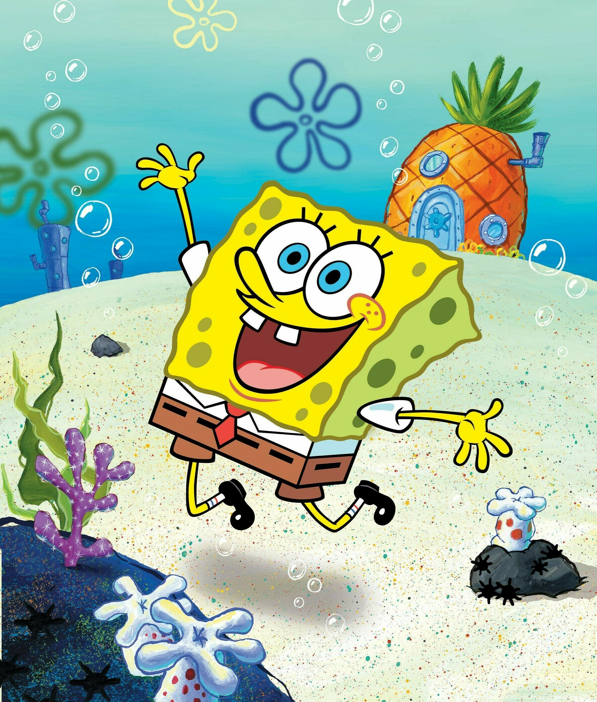
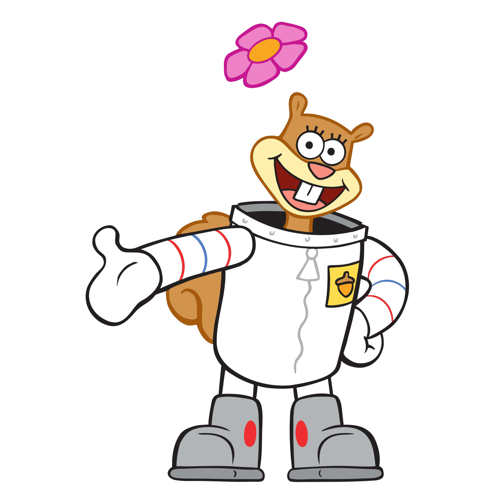

# markdown_example

## This is a picture of Sponge Bob

### This is a picture of Mr. Krabs aligned right

#### This is a picture of Sandy Cheeks aligned left

#### This is a picture of Squidward aligned center

